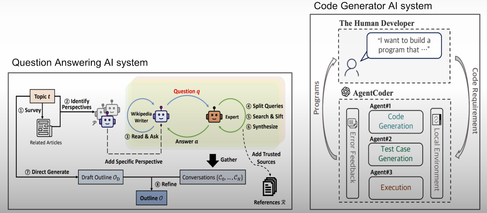

This blog is predominantly my understanding of the *Build and Optimize Agentic Apps with DSPy and MLflow* course from DeepLearning AI.

The course has been separated into four main categories:

### Course Overview

- Introduction to DSPy  
- DSPy Programming — Signatures and Modules  
- Debug Your DSPy Agent with MLflow Tracing  
- Optimizing Agents with DSPy Optimizer  

This course talks about building AI programs with DSPy.

# Introduction

## So, What Exactly Is DSPy?

DSPy is a GenAI authoring framework that simplifies the development of GenAI applications.

As of now, the use cases are as follows:

1. RAG systems  
2. Chain of thought prompting  
3. Structuring the response output generated (like JSON)  
4. LLM pipelines for agents or tools  

### What Does All This Mean?

To answer that, we need to go back a few years — 2022 to be precise — to understand the problem that led to the creation of DSPy. If you recall, it was around this time we were introduced to ChatGPT and other GenAI models. For me personally, it was a revelation as I was in college and suddenly could complete my assignments without help (we won’t talk about the repercussions of doing so).

Along with these models came the development of **compound AI systems**. These are systems that have multiple modules, each handling a subtask which in turn makes LLM calls. Don’t worry if this sounds complicated — we will take it slowly.

Consider the image above: there are two examples of compound systems. At first glance, it may not seem like much, but look closer — the RAG-QA system has multiple robot faces, and the code generator system has multiple agents. This is basically what a compound system is.

To simplify further: in our daily LLM usage, we use them for multiple purposes. For example, I use Claude for coding, Perplexity for research, Gemini on my mobile phone, and so on. Why not think of a system that does all of this together and attains benchmark results (not done yet, so stop searching for the perfect system)? These models also use multiple tools and resources to help with process/prompt execution — like TTS in Gemini, web searching requiring internet access, and more.

In brief, **compound AI systems** tackle AI tasks by combining multiple interacting components. These components can include multiple calls to models, retrievers, or external tools. Retrieval augmented generation (RAG) applications, for example, are compound AI systems, as they combine (at least) a model and a data retrieval system. Compound AI systems leverage the strengths of various AI models, tools, and pipelines to enhance performance, versatility, and reusability compared to solely using individual models, as defined by the [Berkeley AI Research (BAIR) blog](https://bair.berkeley.edu/blog/2024/02/18/compound-ai-systems/).

---

## The Problem That Led to DSPy

Can you recall times when you asked a question to an LLM and the response was not what you desired — or even factually incorrect? But you suspected your question wasn’t clear enough, so you tried to engineer a prompt that might yield a better response. This is basically what prompt engineering is: giving a better prompt to get better results.

However, prompt engineering is complicated:

- It is essentially trial and error with a few string tweaks.  
- You often don’t know what causes the change in response or what changes help reach the desired result.  
- You end up trying embarrassingly many times to perfect the prompt.

For example, I wanted to generate an avatar for my blog using ChatGPT with my normal passport image. The process is resource-heavy and takes some time. It generated an avatar without my eyes. To correct it, I asked the model to add eyes, but it added only my left eye — and this went on repeatedly.

Now consider the same for a string prompt — you might have to modify thousands of characters or words in some cases to reach the desired response. Switching to a newer model would make you repeat the entire process.

**So prompt engineering is both sensitive/brittle and time-consuming.**

---

## Framework Challenges

Another problem comes from frameworks themselves. Frameworks simplify complex tasks by providing abstraction and easier calls to build AI agents.

But where is the problem? Have you ever integrated TensorFlow with GPU? If not, you should try it — it’s a humbling experience. Even today, I switched to PyTorch just to avoid repeating that process. But this comes with its own downsides: you have to learn syntax, design patterns, and custom APIs. Switching frameworks becomes a bigger mess once you are deep into development.

To solve both these problems, DSPy was introduced.

---

## What Is DSPy?

DSPy is a lightweight and flexible framework that simplifies interaction with LMs (Language Models). It provides automatic program optimization, including prompt optimization and LM weights fine-tuning with the help of a DSPy optimizer. It also supports productization features like streaming and async operations (we will explore these later). DSPy provides building blocks without restricting what the user is building and finally simplifies migration both from and to DSPy.

---

## How Is DSPy Special and How Does It Work Seamlessly?

There are three main features:

1. **LM-agnostic programming instead of LM-biased prompting.**  
   Instead of prompt engineering, DSPy interacts with LLMs by defining input fields and output fields. In DSPy context, you can design endpoints like well-engineered RESTful APIs, but unlike traditional APIs, both input and output are defined client-side. *(Note: I know this might be confusing now — I will explain it in the second module.)*

2. **Seamless productization** through native DSPy features like streaming and cache, and through MLflow integration. To keep it simple, MLflow is an ML and AI Ops tool that streamlines end-to-end AI application development. For example, it helps debug AI programs with MLflow tracing, then tracking, and finally deployment.

3. **Automatic program optimization**, such as weight fine-tuning.

Each of these will be discussed separately and in detail in the upcoming modules.

---
